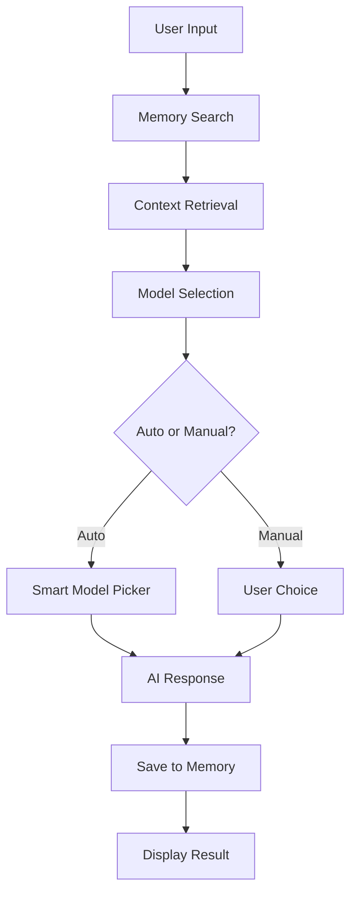

# 🧠 Supermind Smart Chat OpenAI claude agent with Memory

> An intelligent chat application with RAG-powered memory and multi-model AI support

[](https://python.org)
[](https://streamlit.io)
[](https://anthropic.com)
[](https://openai.com)

## ✨ Features

- 🤖 **Multi-Model AI Support** - Switch between Claude and GPT models intelligently
- 🧠 **Smart Memory System** - RAG-powered context retrieval using semantic search
- 🔄 **Auto Model Selection** - Automatically chooses the best AI model based on query type
- 💾 **Persistent Memory** - SQLite database with conversation history
- ⚡ **Real-time Chat** - Streamlit-powered responsive interface
- 🔧 **Easy Configuration** - Simple API key setup in sidebar
- 📊 **Memory Analytics** - View and manage stored memories with similarity scores

## 🎯 Smart Model Selection

The app automatically selects the optimal AI model based on your query:

| Query Type | Recommended Model | Why |
|------------|------------------|-----|
| **Math & Logic** | GPT-4o Mini | Excellent reasoning capabilities |
| **Complex Analysis** | Claude 3.5 Sonnet | Superior analytical thinking |
| **Creative Writing** | Claude 3.5 Sonnet | Natural language generation |
| **Quick Questions** | Claude 3.5 Haiku | Fast, cost-effective responses |

## 🚀 Quick Start

### 1. Clone the repository
```bash
git clone https://github.com/quantumhigherdimensioninnovation/supermind-OpenAI-Claude-agent-ui.git
cd supermind-OpenAI-Claude-agent-ui
```

### 2. Install dependencies
```bash
pip install -r requirements.txt
```

### 3. Set up API keys

- **Get your OpenAI ChatGPT API keys at:** *[https://platform.openai.com/settings/organization/api-keys](https://platform.openai.com/settings/organization/api-keys)*
- **Get your Antrhophic Claude API keys at:** *[https://console.anthropic.com/settings/keys](https://console.anthropic.com/settings/keys)*

Create a `.env` file or configure in the app sidebar:
```bash
# Get Claude API key: https://console.anthropic.com/
CLAUDE_API_KEY=your_claude_api_key_here

# Get OpenAI API key: https://platform.openai.com/
OPENAI_API_KEY=your_openai_api_key_here
```

### 4. Run the application
```bash
streamlit run app.py
```

Open your browser to `http://localhost:8501` and start chatting!

## 🏗️ Architecture



## 🧠 Memory System

The RAG (Retrieval Augmented Generation) system uses:
- **Sentence Transformers** for semantic embeddings
- **Cosine Similarity** for relevance matching
- **SQLite** for persistent storage
- **Automatic categorization** of memories

### Memory Features:
- 📝 **Auto-save conversations** - Important exchanges saved automatically
- 🔍 **Semantic search** - Find relevant context even with different wording
- 🏷️ **Category tagging** - Organize memories by type (facts, preferences, instructions)
- 📊 **Similarity scoring** - See how relevant each memory is to your query

## 🛠️ Tech Stack

- **Frontend**: Streamlit
- **AI Models**: Anthropic Claude, OpenAI GPT
- **Vector Search**: Sentence Transformers + Scikit-learn
- **Database**: SQLite
- **Embeddings**: all-MiniLM-L6-v2
- **Language**: Python 3.8+

## 📊 Supported Models

### Claude Models
- **Claude 3.5 Sonnet** - Balanced performance for complex tasks
- **Claude 3.5 Haiku** - Fast, cost-effective for simple queries  
- **Claude 3 Haiku** - Budget-friendly option
- **Claude 4 Opus** - Premium Cost, Complex analysis
- **Claude 4 Sonnet** - Medium Cost, Balanced tasks

### OpenAI Models
- **GPT-4o Mini** - Excellent for reasoning and general tasks
- **GPT-4o** - Advanced model for complex problems
- **GPT-3.5 Turbo** - Budget-friendly option
- **GPT-4.1** - Flagship, best for complex tasks
- **GPT-4.1 Mini** - Intelligence, speed, and cost
- **o1-mini** - Medium Cost, Reasoning

## 🎨 Screenshots

*Coming soon - add screenshots of your app in action!*

## 🐳 Docker Support

Run with Docker for easy deployment:

```bash
# Build the image
docker build -t smart-chat-app .

# Run the container
docker run -p 8501:8501 smart-chat-app
```

Or use Docker Compose:
```bash
docker-compose up
```

## 📝 Usage Examples

### Basic Chat
```
User: What's the capital of France?
Assistant: The capital of France is Paris. [Model: Claude 3.5 Haiku (auto)]
```

### Memory-Enhanced Response
```
User: Remember I'm learning Python
Assistant: ✅ Memory added!

User: What should I build next?
Assistant: Based on your Python learning journey, here are some project ideas... 
[📚 Used 1 memory: "User is learning Python"]
```

### Smart Model Selection
```
User: Solve this complex calculus problem...
Assistant: [Automatically selects GPT-4o Mini for mathematical reasoning]

User: Write a creative story about...
Assistant: [Automatically selects Claude 3.5 Sonnet for creative writing]
```

## 🤝 Contributing

1. Fork the repository
2. Create a feature branch (`git checkout -b feature/amazing-feature`)
3. Commit your changes (`git commit -m 'Add amazing feature'`)
4. Push to the branch (`git push origin feature/amazing-feature`)
5. Open a Pull Request

## 🔮 Roadmap

- [ ] Voice chat integration
- [ ] Multi-modal support (images, documents)
- [ ] Team collaboration features
- [ ] Advanced memory management
- [ ] Custom model fine-tuning
- [ ] Mobile app version
- [ ] Plugin system

## 📄 License

This project is licensed under the MIT License - see the [LICENSE](LICENSE) file for details.

## 🙏 Acknowledgments

- [Anthropic](https://anthropic.com) for Claude API
- [OpenAI](https://openai.com) for GPT models
- [Streamlit](https://streamlit.io) for the amazing framework
- [Sentence Transformers](https://www.sbert.net/) for embeddings

Project Link: [https://github.com/yourusername/smart-chat-app](https://github.com/yourusername/smart-chat-app)

---

⭐ **Star this repo if you found it helpful!** ⭐
